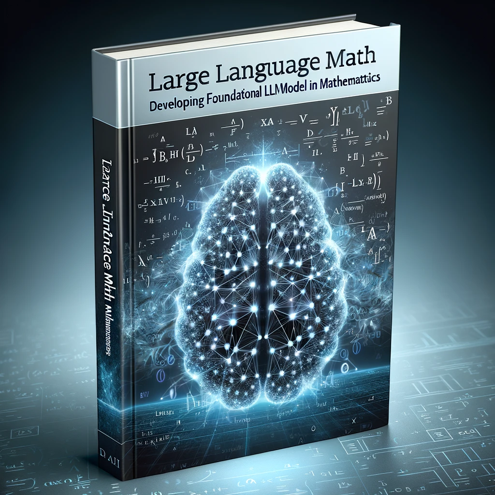

# Large Language Math - The Mathematics of LLM Foundational Models - For Beginners

## Mission Statement
The llmath project is dedicated to demystifying the complex mathematics underpinning Large Language Models (LLM). Our goal is to empower beginners with the necessary mathematical skills and knowledge to contribute to the development of this alien intelligence. We believe in the power of collaboration and open learning to advance our understanding of LLMs.

### Who is this Book For?
This book is designed with beginners in mathematics in mind, especially those who are keen to explore the fascinating world of Large Language Models (LLMs) through the lens of mathematics. Whether you have a basic understanding of mathematics or are starting from scratch, this book is for you.

### Status
- **Stage:** Early Development
- **Focus:** Building foundational content

### Emphasis on R Programming Language
Our journey will primarily utilize the R programming language as our tool for executing and understanding mathematical concepts. R is known for its powerful capabilities in statistical computing and graphics, making it an excellent choice for delving into the mathematics of LLMs. 

### Contribution Guidelines
1. **Fork the Repository:** Start by forking the llmath repository.
2. **Create a Branch:** Make changes in a separate branch.
3. **Submit a Pull Request:** Once you're happy with your contributions, submit a pull request for review.

